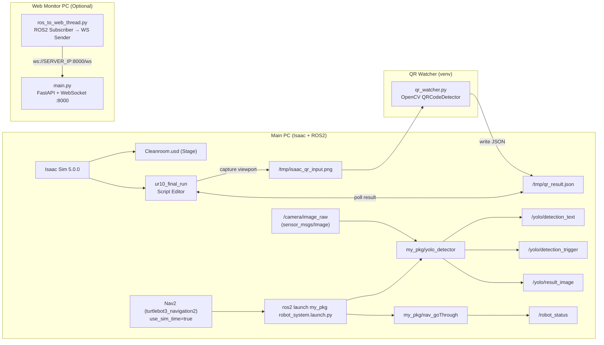
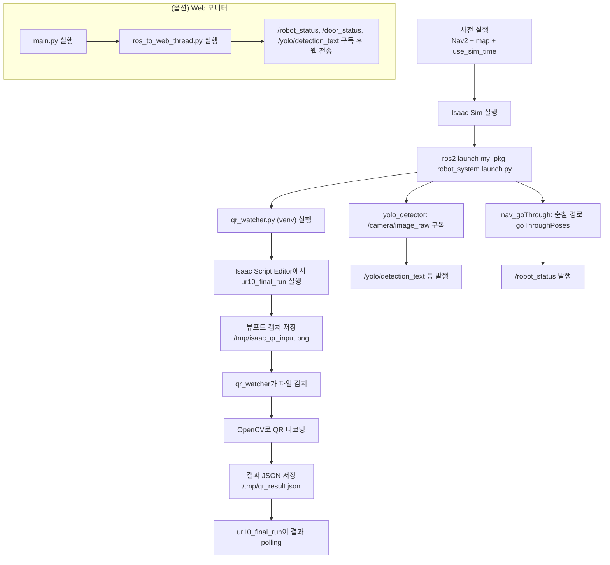

# Isaac Sim 5.0.0 기반 Cleanroom 로봇 시뮬레이션 (UR10 + TurtleBot3 + QR 분기)

## 1. 프로젝트 개요
본 프로젝트는 **Isaac Sim 5.0.0**에서 **Cleanroom.usd** 맵을 로드한 뒤, 로봇(UR10 계열) 시뮬레이션과 ROS2 기반 이동 로봇(TurtleBot3) 네비게이션을 연동하여 **순찰/감시 및 QR 기반 분기 시나리오**를 수행한다.

구성은 크게 3축으로 나뉜다.

- **Isaac Sim 내부 스크립트**: `ur10_final_run` (Script Editor에 붙여넣어 실행)
- **ROS2 패키지**: `my_pkg` (YOLO 감지 + Nav2 goThrough 시나리오)
- **외부 유틸리티**
  - QR 디코더: `qr_watcher.py` (venv에서 실행, 파일 기반 IPC)
  - Web 모니터: `main.py` + `ros_to_web_thread.py` (WebSocket 로그 대시보드)


---

## 2. 제공 파일

### 2.1 Isaac Sim
- `Cleanroom.usd` : 시뮬레이션 맵(Stage)
- `ur10_final_run` : Isaac Sim 5.0.0 **Script Editor 실행 스크립트**

### 2.2 ROS2 패키지
- `my_pkg.zip` : ROS2 패키지(launch 포함)
  - launch: `my_pkg/launch/robot_system.launch.py`
  - nodes:
    - `yolo_detector` (`my_pkg/my_pkg/yolo_detector.py`)
    - `nav_goThrough` (`my_pkg/my_pkg/goThrough.py`)

### 2.3 외부 유틸리티
- `qr_watcher.py` : QR 감시/디코딩 (venv 실행 권장)
- `main.py` : FastAPI WebSocket 대시보드 서버
- `ros_to_web_thread.py` : ROS2 → WebSocket 브릿지

---

## 3. 시스템 아키텍처

### 3.1 구성 요소 아키텍처 (GitHub 호환 Mermaid)


### 3.2 프로세스 플로우 (GitHub 호환 Mermaid)


---

## 4. 실행 환경

### 4.1 Main PC (사용자 제공 스펙)
아래 정보는 사용자가 제공한 명령 출력값을 그대로 정리한 것이다.

- OS: Ubuntu 22.04.5 LTS
- Kernel: 6.8.0-101-generic
- Python: 3.10.12 (system)
- pip: 22.0.2
- GPU: NVIDIA GeForce RTX 5080 Laptop GPU (Driver 570.211.01, CUDA 12.8)
- Torch: 2.10.0+cu128 (`torch.cuda.is_available() == True`)
- RAM: 62Gi (available 47Gi 출력)


### 4.2 Web 모니터 PC
- 사용자가 “web을 돌리는 pc가 따로 있다”고 명시했으나, OS/버전 정보는 제공되지 않았다.

### 4.3 Isaac Sim
- Isaac Sim 5.0.0
- 실행: `~/isaacsim/isaac-sim.selector.sh`

---

## 5. ROS2 패키지(my_pkg) 개요

### 5.1 Launch
- `ros2 launch my_pkg robot_system.launch.py` 는 아래 2개 노드를 동시에 실행한다.
  - `my_pkg/yolo_detector`
  - `my_pkg/nav_goThrough`

### 5.2 Topic/기능 요약

#### yolo_detector
- Subscribe: `/camera/image_raw` (`sensor_msgs/Image`)
- Publish:
  - `/yolo/detection_trigger` (`std_msgs/Bool`) — 클래스 0 감지 여부
  - `/yolo/detection_text` (`std_msgs/String`) — 이벤트 메시지
  - `/yolo/result_image` (`sensor_msgs/Image`) — annotate된 이미지
- 모델 경로(코드 하드코딩):
  - `/home/rokey/IsaacSim-ros_workspaces/humble_ws/src/my_pkg/resource/my_best.pt`
  - 환경에 따라 해당 경로는 반드시 조정이 필요할 수 있다.

#### nav_goThrough
- Nav2 Simple Commander 기반 goThroughPoses 순찰 시나리오
- Publish: `/robot_status` (`std_msgs/String`)
  - “Cleanroom 가는중입니다.” 등 상태 메시지 발행

---

## 6. 의존성 (실제 import 기준)

### 6.1 QR Watcher (venv 권장)
- `qr_watcher.py` 직접 import 기준
  - `numpy`
  - `opencv-contrib-python` (QR 기능 포함 빌드 사용)

권장 requirements (venv용):
```txt
numpy<2.0
opencv-contrib-python==4.8.0.74
```

### 6.2 ROS2 노드(my_pkg)
- `yolo_detector.py` 직접 import 기준 (ROS 패키지 제외)
  - `ultralytics`
  - `opencv-python`
- Torch는 Main PC에 이미 설치되어 있으므로(사용자 제공 정보), **`ultralytics` 설치 시 torch를 임의로 교체하지 않도록 주의**한다.

권장 requirements (pip 영역만):
```txt
ultralytics
opencv-python
```

> `rclpy`, `cv_bridge`, `sensor_msgs`, `std_msgs`, `nav2_simple_commander` 등은 ROS2 설치/워크스페이스 영역에서 제공되는 구성이 일반적이므로 pip requirements에서는 제외한다.

### 6.3 Web 모니터
- `main.py`, `ros_to_web_thread.py` 직접 import 기준
```txt
fastapi
uvicorn
websockets
```

---

## 7. 설치 및 실행 순서 (체크리스트)


### 7.1 Main PC 체크리스트 (Isaac + ROS2)

#### 설치/준비
| 체크 | 항목 | 명령/경로 | 비고 |
|---|---|---|---|
| [ ] | Isaac Sim 실행 스크립트 확인 | `~/isaacsim/isaac-sim.selector.sh` | Isaac Sim 5.0.0 |
| [ ] | Cleanroom 맵 준비 | `Cleanroom.usd` | Isaac Sim Stage 로드 |
| [ ] | ROS2 워크스페이스에 `my_pkg` 배치 | 예: `~/IsaacSim-ros_workspaces/humble_ws/src/my_pkg` | 사용자 코드가 절대경로를 참조 |
| [ ] | `my_pkg` 빌드/소스 | `colcon build` 후 `source install/setup.bash` | 환경에 따라 생략/변형 가능 |
| [ ] | YOLO 모델 경로 확인 | `my_pkg/resource/my_best.pt` | `yolo_detector.py` 내 절대경로 사용 |

#### 실행 (권장 순서)
| 체크 | 순서 | 명령 | 비고 |
|---|---|---|---|
| [ ] | 0 | (필수) Nav2 실행 | 아래 7.3 참조 |
| [ ] | 1 | Isaac Sim 실행 | `~/isaacsim/isaac-sim.selector.sh` |
| [ ] | 2 | Isaac Sim에서 Stage 로드 | `Cleanroom.usd` |
| [ ] | 3 | ROS2 패키지 실행 | `ros2 launch my_pkg robot_system.launch.py` |
| [ ] | 4 | Isaac Script 실행 | Script Editor에 `ur10_final_run` 붙여넣기 → Run |

### 7.2 QR Watcher 체크리스트 (venv)


| 체크 | 단계 | 명령 | 비고 |
|---|---|---|---|
| [ ] | 1 | `sudo apt update` |  |
| [ ] | 2 | `sudo apt install python3-venv -y` |  |
| [ ] | 3 | `python3 -m venv qr_standalone_env` | venv 생성 |
| [ ] | 4 | `source qr_standalone_env/bin/activate` | venv 활성화 |
| [ ] | 5 | `pip install numpy` | 이후 버전 조정 가능 |
| [ ] | 6 | `pip install opencv-contrib-python==4.8.0.74` | QR 기능 포함 |
| [ ] | 7 | `pip install "numpy<2.0"` | OpenCV 4.8과 호환 목적 |
| [ ] | 8 | 설치 확인 | `python3 -c "import cv2; print(cv2.__version__); import numpy; print(numpy.__version__)"` |
| [ ] | 9 | 실행 | `python3 qr_watcher.py` |

### 7.3 (필수) Nav2 선행 실행
Start 전 반드시 아래 명령을 실행한다.

```bash
TURTLEBOT3_MODEL=burger \
ros2 launch turtlebot3_navigation2 navigation2.launch.py \
  map:=/home/rokey/IsaacSim-ros_workspaces/humble_ws/src/turtlebot3/turtlebot3_navigation2/map/cleanroom_map.yaml \
  use_sim_time:=true
```

> 이 단계는 사용자가 “start 전 반드시 실행”을 명시한 사항이다.

## 8. Web 로그 모니터 실행

Web 모니터는 별도 PC에서 실행하는 구성을 전제로 한다. 다만 네트워크/ROS 도메인 설정은 환경별로 달라질 수 있으므로 아래는 기본 절차만 제시한다.

### 8.1 WebSocket 서버 실행
```bash
python3 main.py
```
- 기본 포트: 8000
- 접속: `http://<SERVER_IP>:8000/`

### 8.2 ROS → Web 브릿지 실행
```bash
python3 ros_to_web_thread.py
```
- 기본 구독 토픽:
  - `/robot_status`
  - `/door_status`
  - `/yolo/detection_text`
- WebSocket URI는 코드에 하드코딩되어 있으므로 환경에 맞게 수정해야 한다.
  - 예: `ws://192.168.189.132:8000/ws`

---

## 9. 설정 포인트(환경 의존)

### 9.1 Isaac Sim 스테이지(Prim 경로)
`ur10_final_run`은 아래 후보 경로들에서 실제 Prim을 탐색해 첫 번째로 유효한 경로를 사용한다.

- 로봇 루트(예)
  - Giving: `/Root/ur10_giving`, `/Root/ur_10_giving`
  - Received: `/Root/ur10_received` 계열 후보
- Waypoint/Place
  - `/Root/way_point_000`, `/Root/way_point_01`, `/Root/way_point_001`
  - `/Root/place_for_a`, `/Root/place_for_b`, `/Root/place_for_c`
- 카메라
  - Giving camera 후보: `/Root/way_point_01_top_camera`, `/Root/camera_1`

따라서 **Cleanroom.usd 내부의 Prim 이름이 위 후보와 다르면 스크립트가 즉시 예외를 발생**시킨다.

### 9.2 바이알 USD 경로
`ur10_final_run`은 타입(A/B/C)별 바이알 USD 경로가 절대경로로 정의되어 있다.

- 예: `/home/rokey/Downloads/vial_usd(1)/vial_usd/medicine_A.usdc`

환경이 다르면 해당 경로를 반드시 수정해야 한다.

### 9.3 YOLO 모델 경로
`yolo_detector.py`는 모델 경로가 절대경로로 하드코딩되어 있다.

- `/home/rokey/IsaacSim-ros_workspaces/humble_ws/src/my_pkg/resource/my_best.pt`

`my_pkg`를 다른 워크스페이스에 배치했다면 경로를 수정하거나, 패키지 share 경로 기반으로 바꾸는 방식(권장)으로 개선이 필요하다.

### 9.4 QR IPC 파일 경로
Isaac Sim 스크립트와 QR watcher는 아래 경로로 파일 기반 IPC를 수행한다.

- 입력 이미지: `/tmp/isaac_qr_input.png`
- 결과 JSON: `/tmp/qr_result.json`

두 구성 요소가 동일 경로를 사용해야 정상 동작한다.

---

## 10. 트러블슈팅

- QR 디코딩이 계속 실패하는 경우
  - venv에서 `opencv-contrib-python==4.8.0.74` 및 `numpy<2.0` 조합이 유지되는지 확인
  - `/tmp/isaac_qr_input.png`가 실제로 갱신되는지 확인

- Nav2가 동작하지 않거나 시간이 멈춘 것처럼 보이는 경우
  - `use_sim_time:=true`로 실행했는지 확인
  - `/clock` 퍼블리시 여부(Isaac Sim ROS2 브리지 설정)에 따라 Nav2 동작이 달라질 수 있음

- YOLO 노드가 이미지를 받지 못하는 경우
  - `/camera/image_raw` 토픽이 존재하는지 확인
  - Isaac Sim에서 ROS2 카메라 퍼블리셔가 설정되어 있는지 확인

- Web 모니터가 연결되지 않는 경우
  - `ros_to_web_thread.py`의 `self.uri`(WebSocket 주소)가 실제 서버 IP/포트와 일치하는지 확인

---

## 11. 요약
- **Isaac Sim 실행 → Nav2 선행 실행 → ROS2 launch → QR watcher 실행 → Isaac Script 실행** 순서를 준수하면 파이프라인이 동작한다.
- 환경 의존성이 큰 경로(USD Prim, 바이알 USD 절대경로, YOLO 모델 경로, WebSocket URI)는 README의 “설정 포인트”를 기준으로 우선 점검한다.
